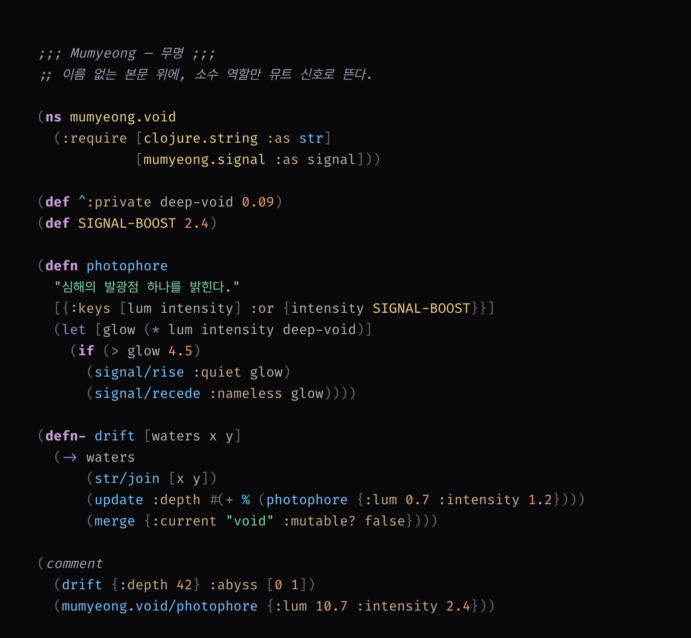

# BitYoungjae.nvim

> **Mumyeong** — Neon Glass

BitYoungjae가 개인적으로 사용하기 위해 만든 다크 Neovim 컬러스킴입니다.

아연 무채색 베이스 위에서 UI는 유리처럼 중립적으로 머물고, 코드 토큰만 형광으로 뜹니다. [omarchy-mumyeong-theme](https://github.com/bityoungjae/omarchy-mumyeong-theme)과 배경·선택·커서·진단 색을 공유해 한 시스템처럼 이어집니다. Clojure, TypeScript, Markdown, JSON에 맞춰 역할 색을 나눴습니다.



## 특징

- 본문 대비 약 9.7:1 (할로네이션 방지 밴드, APCA Lc ≈ -62)
- 데스크톱 테마와 팔레트 앵커 공유 (bg·selection·cursor·error·git 색상 그대로)
- 주석이 배경·커서라인·Visual 모두에서 읽힘
- 에러 로즈는 진단·삭제·FIX에만 사용
- 키워드는 색 + bold, 역할 간 ΔE 15+ 보장 (`tests/contrast.lua` 66개 검사)
- `transparent`는 본문 배경에만 적용 (플로트·diff 틴트 유지)
- Lualine 및 주요 플러그인 하이라이트 포함

## 요구사항

- Neovim >= 0.8.0
- `termguicolors` 활성화

## 설치

### lazy.nvim

```lua
{
  "bityoungjae/bityoungjae.nvim",
  lazy = false,
  priority = 1000,
  config = function()
    require("bityoungjae").setup({
      italic_comments = true,
    })
    vim.cmd([[colorscheme bityoungjae]])
  end,
}
```

`italic_comments`를 `false`로 두면 주석에서 이탤릭을 끕니다. `transparent`와 `terminal_colors`도 `setup()`으로 제어합니다.

### packer.nvim

```lua
use {
  "bityoungjae/bityoungjae.nvim",
  config = function()
    vim.cmd([[colorscheme bityoungjae]])
  end,
}
```

### vim-plug

```vim
Plug 'bityoungjae/bityoungjae.nvim'
colorscheme bityoungjae
```

## 사용법

```lua
vim.cmd([[colorscheme bityoungjae]])
```

### Lualine

```lua
require("lualine").setup {
  options = {
    theme = "bityoungjae",
  },
}
```

## 지원 플러그인

| 플러그인              | 플러그인           | 플러그인             |
| --------------------- | ------------------ | -------------------- |
| blink.cmp             | bufferline.nvim    | dashboard-nvim       |
| flash.nvim            | gitsigns.nvim      | grug-far.nvim        |
| indent-blankline.nvim | lazy.nvim          | lualine.nvim         |
| mason.nvim            | mini.indentscope   | neo-tree.nvim        |
| noice.nvim            | nvim-cmp           | render-markdown.nvim |
| smear-cursor.nvim     | snacks.nvim        | telescope.nvim       |
| todo-comments.nvim    | treesitter-context | trouble.nvim         |
| which-key.nvim        |                    |                      |

## 컬러 팔레트

자세한 역할 매핑은 [docs/colors.md](docs/colors.md)를 참고하세요.

### 배경

| 이름        | 색상코드  | 용도                   |
| ----------- | --------- | ---------------------- |
| Void        | `#09090B` | 메인 에디터 (oma0)     |
| Cursor Line | `#202024` | 현재 줄                |
| Onyx        | `#18181B` | 사이드바, 팝업 (oma1)  |
| Charcoal    | `#27272A` | 선택 영역 (oma2)       |

### 구문

| 이름        | 색상코드  | 용도                       |
| ----------- | --------- | -------------------------- |
| Frost       | `#B4B4BC` | 본문, 변수                 |
| Glass Smoke | `#9BA3AF` | 주석                       |
| Thistle     | `#C79FD6` | 키워드 (bold, oma15 계열)  |
| Sky         | `#7DC4FF` | 함수, 주 형광              |
| Emerald     | `#82D9A4` | 문자열 (oma14 계열)        |
| Brass       | `#F0D48A` | 타입 (oma13 계열)          |
| Sand        | `#EDA87C` | 숫자 (oma12 계열)          |
| Muted Gold  | `#CBAF8F` | 상수                       |
| Teal        | `#74C0BE` | 속성, JSON 키              |
| Steel       | `#8593A3` | 연산자                     |
| Muted Rose  | `#E08A8A` | 에러, 삭제 (oma11)         |

## 개발

팔레트나 하이라이트를 바꾼 뒤에는 회귀 테스트를 돌립니다. 본문 대비 밴드, 주석 하한, 역할 간 ΔE, omarchy 앵커 일치를 검사합니다.

```bash
nvim --headless -u tests/minimal_init.lua -c "luafile tests/contrast.lua" -c "qa!"
```

설치 환경과 핵심 대비는 `:checkhealth bityoungjae`로 확인할 수 있습니다. 새 플러그인 지원은 `lua/bityoungjae/groups/plugins/`에 파일만 추가하면 자동으로 로드됩니다.

## 라이선스

MIT
